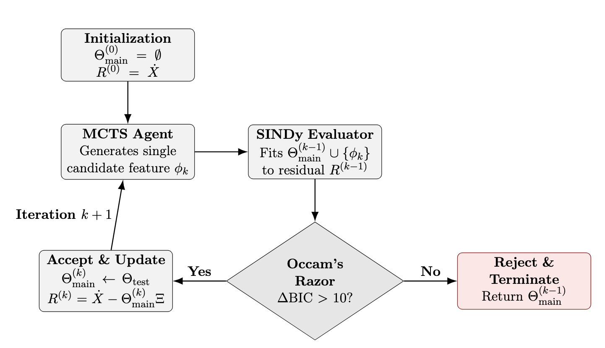
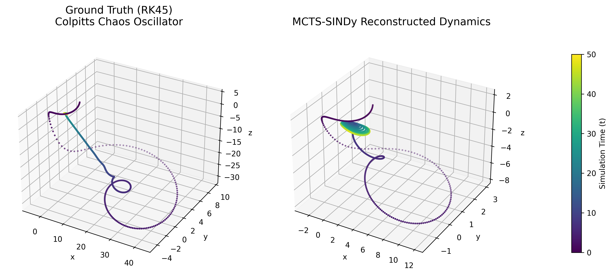

# Monte Carlo Tree Search for Equation Discovery (MCTS-SINDy)

This project explores a hybrid architecture for symbolic regression by combining the combinatorial search power of Monte Carlo Tree Search (MCTS) with the robust, mathematically parsimonious coefficient extraction of Sparse Identification of Nonlinear Dynamical Systems (SINDy).

This repository was developed as an end-of-semester "Monte Carlo Tree Search" final course project under the supervision of Pr. Tristan Cazenave for the M2 IASD Master's program at Université Paris Dauphine-PSL.

Authors: Gabriella Fernandes Macedo and Ruben Ifrah

## Overview

Discovering governing physical equations from noisy trajectory data is a famously difficult combinatorial problem. Traditional sparse regression methods (like PySINDy) rely on pre-built structural libraries (such as polynomials up to degree N) and catastrophically overfit in the presence of noise when dealing with deeply nested non-linearities. Pure symbolic mathematics models, like the Symbolic Physics Learner (SPL), suffer from massive computational overhead because they attempt to optimize continuous physical constants simultaneously while randomly exploring discrete mathematical syntax.

MCTS-SINDy bridges this gap:
1. MCTS constructs mathematical grammar trees sequentially as a discrete Markov Decision Process.
2. Instead of guessing coefficients, the MCTS sequence is immediately compiled into a sparse feature matrix.
3. SINDy analytically solves for the optimal continuous coefficients using orthogonal matching pursuit logic in continuous sub-spaces.
4. The tree is rewarded using a Bayesian Information Criterion (BIC), enforcing strict Occam's Razor discipline to punish deeply nested structures that do not offer massive predictive improvements.



## Benchmarks & Results

The architecture is benchmarked against systems of increasing complexity using high-precision Runge-Kutta 45 synthetic data, across multiple noise tiers (0%, 1%, 5% Gaussian noise applied to target derivatives).

1. Damped Harmonic Oscillator: MCTS-SINDy perfectly bounds parsimony at 2 features across all noise tiers, whereas baseline algorithms degrade and overfit.
2. Colpitts Chaos Oscillator: This acts as the rigorous architecture acid test because the target equations contain explicitly nested parameters alongside strict constant offsets. The MCTS completely solves this nested dynamic by decoupling structure generation from parameters.
3. Deep Nested Bound: The model successfully evaluates systems requiring nested sine dependencies reaching depth thresholds standard dictionaries cannot populate.

### Visualizing the Colpitts Chaos Attractor



## Repository Structure

```text
MCTS_Equation_Discovery/
├── src/                # Core algorithmic logic
│   ├── evaluate.py     # Maps grammar trees to numpy trajectory data
│   ├── grammar.py      # Abstract mathematical syntax definitions
│   ├── main.py         # Entry point for sequence-to-library conversion
│   ├── mcts.py         # The generic Monte Carlo Tree Search agent
│   ├── reward.py       # BIC scaling and STLSQ reward evaluations
│   └── tree.py         # Graph node parsers for symbol sequences
├── utils/
│   ├── metrics.py      # RMSE and mathematical validations
│   └── data_generators.py # RK45 high-precision physical environments
├── experiments/        # Analytical execution scripts
│   ├── colpitts_deep_dive.py
│   ├── run_benchmarks.py
│   └── run_pipeline.py # Evaluation gauntlet (MCTS vs SINDy vs SPL)
├── results/            # Auto-generated JSON telemetry and PNG plots
├── figures/            # Architectural flowcharts and benchmark diagrams
├── report.tex          # LaTeX Project Source Code Document
└── README.md
```

## Installation & Usage

1. Clone the repository:
   ```bash
   git clone https://github.com/gabriellafrds/MCTS_Equation_Discovery.git
   cd MCTS_Equation_Discovery
   ```

2. Install requirements:
   (Ensure you have Python 3.8+)
   ```bash
   pip install -r requirements.txt
   ```

3. Running Experiments:
   Because the codebase is strictly modularized into Python packages, execute scripts from the root directory using the Python module execution flag (-m).

   To run the Colpitts Chaos deep dive experiment and generate traces:
   ```bash
   python -m experiments.colpitts_deep_dive
   ```
   
   To run isolated benchmarks or testing pipelines:
   ```bash
   python -m experiments.run_benchmarks
   python -m experiments.run_pipeline
   ```

4. Viewing Results:
   Execution pipelines will automatically format and export their telemetry directly into the `results/` directory as structured JSON matrices or graphic diagram exports.